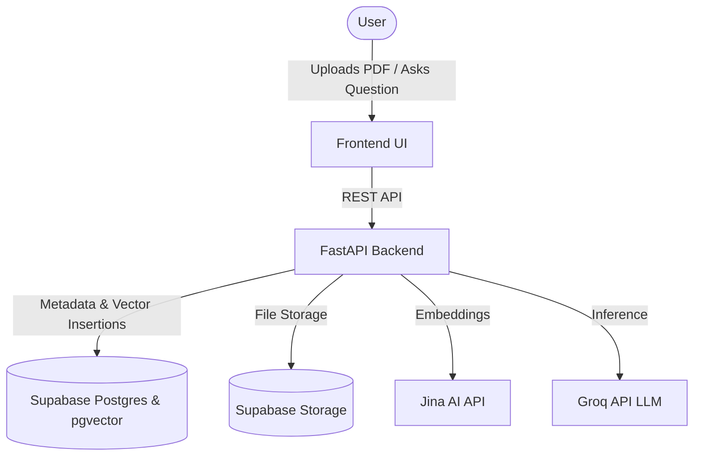
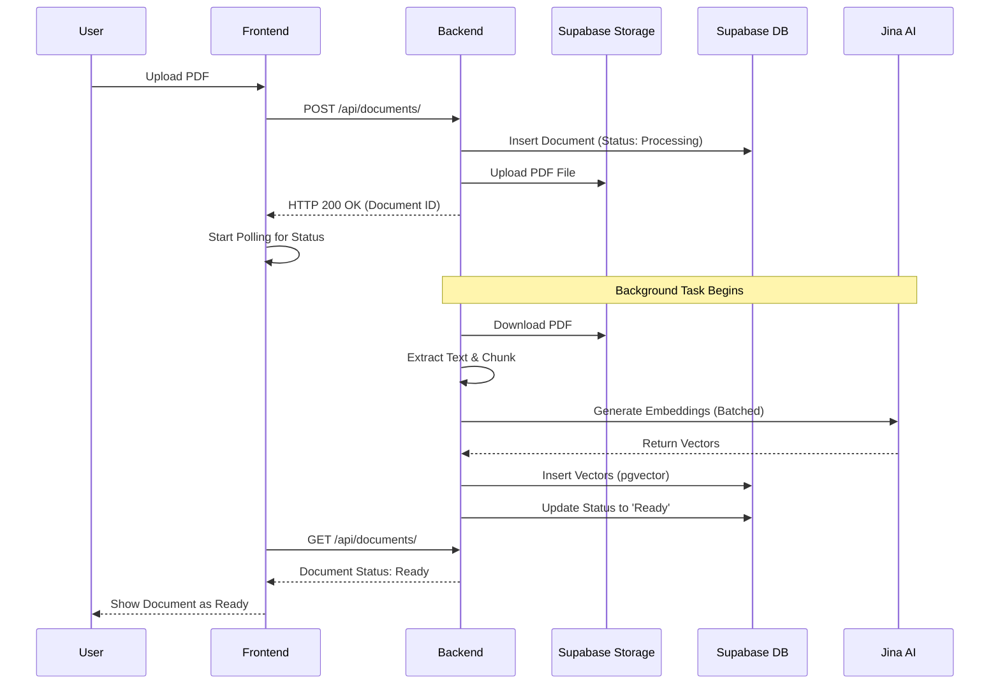
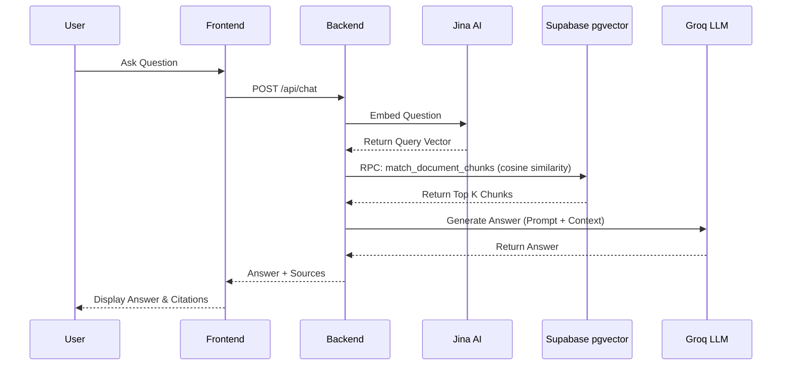

# Lumos

> Chat with your documents. Upload PDFs, search instantly, and get accurate answers with cited sources.

Lumos is an open-source AI Document Intelligence Platform. It allows users to upload multiple PDF documents, automatically chunks and indexes the text using Jina AI embeddings, and provides a chat interface to ask questions about the documents using Retrieval-Augmented Generation (RAG).

---

## Features

- **Multi-Document Support:** Upload and manage multiple PDF documents simultaneously.
- **Hosted Embeddings:** Text is chunked and embedded using the Jina AI Embeddings API (`jina-embeddings-v3`) with Matryoshka truncation (384 dimensions) instead of loading local embedding models, reducing deployment memory requirements.
- **Vector Search:** Cosine similarity search powered by Supabase `pgvector`.
- **Citations:** Expandable source cards show exactly which pages and snippets the AI used to generate its answer.
- **Clean UI:** A user interface built with HTML, CSS, and JavaScript with zero frontend framework dependencies.

---

## Architecture

Lumos utilizes a decoupled architecture to separate concerns.



### Flow Diagrams

#### Document Upload Flow



#### Chat Request Flow



## Tech Stack

### Frontend
- HTML5, CSS3 (Custom Properties), ES6 JavaScript (No frameworks)
- `marked.js` for markdown rendering
- `lucide` for iconography

### Backend
- **Framework:** FastAPI (Python)
- **PDF Processing:** PyPDF
- **Chunking:** LangChain RecursiveCharacterTextSplitter
- **Embeddings:** Jina AI (`jina-embeddings-v3`) via REST API
- **LLM:** Groq API (Llama3/Mixtral)

### Database
- **Provider:** Supabase
- **Extensions:** `pgvector` for semantic search
- **Storage:** Supabase Storage for raw PDF persistence

---

## Project Structure

```text
Lumos/
├── backend/                  # FastAPI Application
│   ├── config.py             # Environment configurations
│   ├── database.py           # Supabase client initialization
│   ├── ingest.py             # PDF extraction and chunking
│   ├── main.py               # FastAPI application entry point
│   ├── routes/               # API endpoint definitions
│   ├── schemas/              # Pydantic data models
│   └── services/             # Core business logic (RAG, Embeddings)
├── frontend/                 # Vanilla JS / HTML / CSS Client
│   ├── index.html            # Main UI
│   ├── style.css             # CSS Entry point
│   ├── css/                  # Modular CSS files
│   └── js/                   # Modular JS files
└── docs/                     # Technical Documentation
```

Please refer to the `docs/` folder for deeper dives into the [Architecture](docs/architecture.md), [Database](docs/database.md), and [Frontend](docs/frontend.md).

---

## Cost Analysis

Lumos is designed to be fully deployable on free-tier platforms.

| Component | Provider | Cost | Notes |
| :--- | :--- | :--- | :--- |
| **Frontend** | Vercel | Free | Hobby tier is sufficient for personal/demo use. |
| **Backend** | Render | Free | Free tier works perfectly (app sleeps after inactivity). |
| **Database** | Supabase | Free | Free tier includes pgvector and up to 1GB storage. |
| **Embeddings** | Jina AI | Free | Generous free tier (1M tokens/month). |
| **LLM** | Groq | Free | High rate limits on the free tier. |

**Total Cost: $0/month** for typical personal or demonstration usage.

---

## Getting Started

### Environment Variables

Create a `.env` file in the `backend/` directory:

```env
# Supabase Configuration
SUPABASE_URL=your-supabase-url
SUPABASE_SERVICE_ROLE_KEY=your-supabase-service-role-key
SUPABASE_BUCKET=documents
DATABASE_URL=your-supabase-db-url

# LLM Configuration
GROQ_API_KEY=your-groq-api-key
GROQ_MODEL=llama-3.1-8b-instant

# Embeddings Configuration
JINA_API_KEY=your-jina-api-key
JINA_EMBEDDING_MODEL=jina-embeddings-v3

# Application Configuration
SIMILARITY_THRESHOLD=1.5
```

### Database Setup

1. Create a Supabase project.
2. Enable `pgvector`.
3. Run the SQL schemas located in `docs/sql/` in the Supabase SQL editor.
4. Create a public storage bucket named `documents` (or whatever you set `SUPABASE_BUCKET` to).

### Running Locally

**Start the Backend:**
```bash
cd backend
pip install -r requirements.txt
uvicorn main:app --host 0.0.0.0 --port 8000 --reload
```

**Start the Frontend:**
```bash
cd frontend
python -m http.server 8080
```
Open your browser to `http://localhost:8080`.

---

## Configuration Validation

To ensure a smooth developer experience, the backend performs configuration validation on startup. If any required API keys (`SUPABASE_URL`, `SUPABASE_SERVICE_ROLE_KEY`, `GROQ_API_KEY`, `JINA_API_KEY`) are missing, the server will raise a `RuntimeError` immediately rather than failing during the first upload.

---

## API Reference

### Health Check
**`GET /api/health`**
Returns the status of the database, storage, embedding provider, and LLM provider.
```json
{
  "status": "healthy",
  "database": "connected",
  "storage": "connected",
  "embedding_provider": "configured",
  "llm_provider": "configured"
}
```

### Documents
**`GET /api/documents/`**
Lists all uploaded documents ordered by creation date.

**`POST /api/documents/`**
Uploads a new PDF document. Starts background processing for chunking and embeddings.
- **Body:** `multipart/form-data` with a `file` field (PDF).
- **Response:** `{"id": "doc_uuid", "filename": "example.pdf"}`

**`DELETE /api/documents/{id}`**
Deletes a document, its chunks (via DB cascade), and the file from Storage.
- **Response:** `{"status": "success"}`

### Chat
**`POST /api/chat`**
Queries a specific document using RAG.
- **Body (JSON):**
  ```json
  {
    "document_id": "doc_uuid",
    "question": "What is the main topic?"
  }
  ```
- **Response (JSON):**
  ```json
  {
    "answer": "The main topic is...",
    "sources": [
      {
        "page": 1,
        "content": "...",
        "score": 0.85
      }
    ]
  }
  ```

---

## Deployment

Lumos is designed to be fully deployable on free-tier platforms.
See [deployment.md](docs/deployment.md) for full instructions on deploying to Render, Vercel, and Supabase.

---

## Known Limitations

- **Single-document chat only:** You can currently only query one document at a time.
- **No OCR for scanned PDFs:** The current extraction relies on embedded text. Image-only PDFs will not work.
- **No multi-user authentication:** The system currently operates as a single-tenant application.
- **Background Processing:** Document processing relies on FastAPI `BackgroundTasks` within the web service (no dedicated worker like Celery/Redis).
- **Free Tier Constraints:** Usage is subject to the rate limits and quotas of the free tiers used (Render, Groq, Jina).

---

## Future Roadmap

- [ ] Chat history persistence
- [ ] Multi-document cross-referencing queries
- [ ] Support for DOCX and TXT files
- [ ] Streaming LLM responses (Server-Sent Events)
