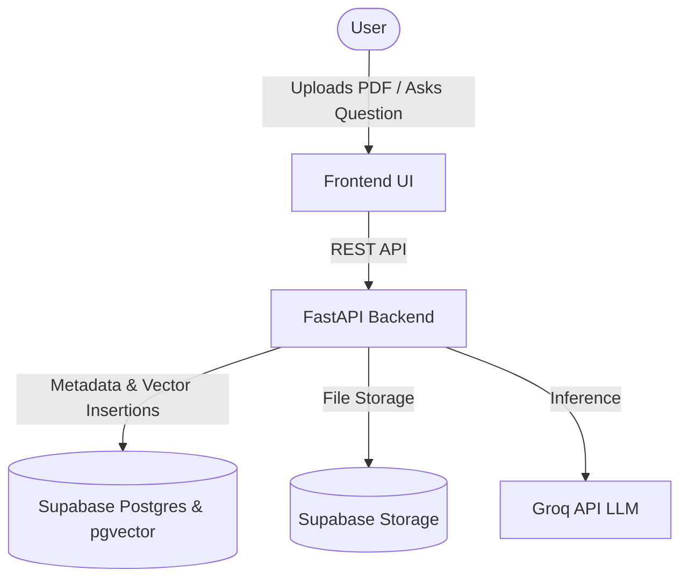

# Lumos

> Chat with your documents. Upload PDFs, search instantly, and get accurate answers with cited sources.

Lumos is a premium, open-source AI Document Intelligence Platform. It allows users to upload multiple PDF documents, automatically chunks and indexes the text using local embeddings, and provides a polished, beautiful chat interface to ask questions about the documents using Retrieval-Augmented Generation (RAG).


---

## Features

- **Multi-Document Support:** Upload and manage multiple PDF documents simultaneously.
- **Fast, Local Embeddings:** Text is chunked and embedded locally using `all-MiniLM-L6-v2` for speed and privacy.
- **Vector Search:** Highly efficient cosine similarity search powered by Supabase `pgvector`.
- **Accurate Citations:** Expandable source cards show exactly which pages and snippets the AI used to generate its answer.
- **Premium UI:** A calm, spacious, and extremely polished UI inspired by modern AI tools (Claude, Granola, Notion AI) built with zero frontend dependencies.

---

## Architecture

Lumos utilizes a decoupled architecture to separate concerns.



## Tech Stack

### Frontend
- HTML5, CSS3 (Custom Properties), ES6 JavaScript (No frameworks)
- `marked.js` for markdown rendering
- `lucide` for iconography

### Backend
- **Framework:** FastAPI (Python)
- **PDF Processing:** PyPDF
- **Chunking:** LangChain RecursiveCharacterTextSplitter
- **Embeddings:** SentenceTransformers (`all-MiniLM-L6-v2`)
- **LLM:** Groq API (Llama3/Mixtral)

### Database
- **Provider:** Supabase
- **Extensions:** `pgvector` for semantic search
- **Storage:** Supabase Storage for raw PDF persistence

---

## Project Structure

```text
Lumos/
├── backend/                  # FastAPI Application
├── frontend/                 # Vanilla JS / HTML / CSS Client
└── docs/                     # Technical Documentation
```

Please refer to the `docs/` folder for deeper dives into the [Architecture](docs/architecture.md), [Database](docs/database.md), and [Frontend](docs/frontend.md).

---

## Getting Started

### Environment Variables

Create a `.env` file in the `backend/` directory:

```env
SUPABASE_URL=your-supabase-url
SUPABASE_SERVICE_ROLE_KEY=your-supabase-service-role-key
GROQ_API_KEY=your-groq-api-key
GROQ_MODEL=llama3-8b-8192
SIMILARITY_THRESHOLD=0.3
```

### Database Setup

1. Create a Supabase project.
2. Enable `pgvector`.
3. Run the SQL schemas located in `docs/sql/` in the Supabase SQL editor.
4. Create a public storage bucket named `reports`.

### Running Locally

**Start the Backend:**
```bash
cd backend
pip install -r requirements.txt
uvicorn main:app --host 0.0.0.0 --port 8000 --reload
```

**Start the Frontend:**
```bash
cd frontend
python -m http.server 8080
```
Open your browser to `http://localhost:8080`.

---

## API Overview

- `GET /api/documents/`: List all documents.
- `POST /api/documents/`: Upload a new PDF.
- `DELETE /api/documents/{id}`: Delete a document.
- `POST /api/chat/`: Query a document using RAG.

See [api.md](docs/api.md) for detailed payloads.

---

## Deployment

Lumos is designed to be fully deployable on free-tier platforms.
See [deployment.md](docs/deployment.md) for full instructions on deploying to Render, Vercel, and Supabase.

---

## Future Roadmap

- [ ] Chat history persistence
- [ ] Multi-document cross-referencing queries
- [ ] Support for DOCX and TXT files
- [ ] Streaming LLM responses (Server-Sent Events)
