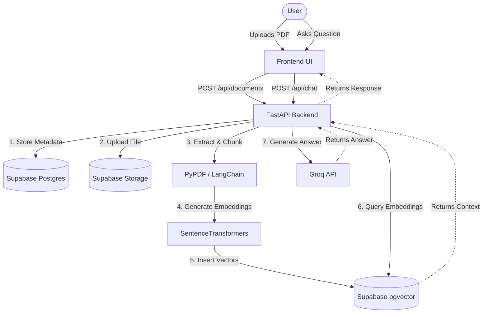

# Lumos Architecture

Lumos is a monolithic AI Document Intelligence Platform featuring a FastAPI backend and a decoupled Vanilla HTML/JS frontend.

## High-Level Architecture

The architecture is divided into two primary components, running as separate services but integrated via REST APIs.

### 1. Frontend (Vanilla ES6)
The frontend relies strictly on modern native web features (ES6 modules, CSS Custom Properties). It uses no build steps, bundlers, or frameworks.
- **Routing/State:** Client-side orchestration via `app.js` and `state.js`.
- **API Layer:** `api.js` serves as a dedicated fetch wrapper.
- **UI Rendering:** `ui.js` handles imperative DOM updates.

### 2. Backend (FastAPI Monolith)
A synchronous/asynchronous FastAPI monolith handles document ingestion and AI retrieval.
- **Ingestion Pipeline:** PyPDF reads the file, LangChain recursively chunks the text, and SentenceTransformers generates embeddings locally using `all-MiniLM-L6-v2`.
- **Retrieval Pipeline:** Supabase `pgvector` performs cosine similarity search. Groq LLM generates answers based strictly on retrieved chunks.

## Data Flow Diagram

